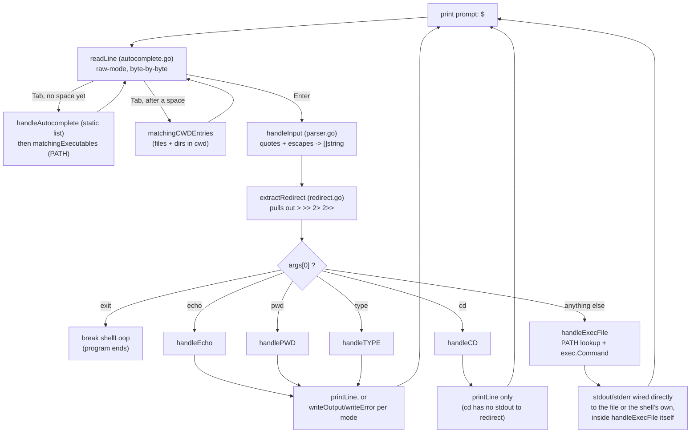

# shell-golang


A POSIX-flavoured Unix shell, written from scratch in Go — no `readline` library,
no shell-out to `/bin/sh`. It owns the terminal directly: raw-mode keystroke
handling, its own quote/escape parser, its own tab-completion engine, and its
own I/O redirection, all built on the standard library plus one terminal
package (`golang.org/x/term`).

```
$ echo 'hello    world'
hello    world
$ echo "say \"hi\""
say "hi"
$ pwd > /tmp/where.txt
$ type cd
cd is a shell builtin
$ git st<TAB>
status
```

---

## Table of contents

- [Why this exists](#why-this-exists)
- [Project structure](#project-structure)
- [How the shell decides what to do](#how-the-shell-decides-what-to-do)
  - [main.go — the loop and the dispatcher](#maingo--the-loop-and-the-dispatcher)
  - [parser.go — turning one typed line into arguments](#parsergo--turning-one-typed-line-into-arguments)
  - [builtins.go — the five commands the shell handles itself](#builtinsgo--the-five-commands-the-shell-handles-itself)
  - [redirect.go — sending output to a file instead of the screen](#redirectgo--sending-output-to-a-file-instead-of-the-screen)
  - [autocomplete.go — the Tab key](#autocompletego--the-tab-key)
- [Flowchart: one command, start to finish](#flowchart-one-command-start-to-finish)
- [Features (what you can type)](#features-what-you-can-type)
  - [Builtins](#builtins)
  - [Quoting and escaping](#quoting-and-escaping)
  - [I/O redirection](#io-redirection)
  - [Tab completion](#tab-completion)
  - [External commands](#external-commands)
  - [Cross-platform correctness](#cross-platform-correctness)
- [Example session](#example-session)
- [Getting started](#getting-started)
- [Testing](#testing)
- [Known limitations](#known-limitations)
- [AI-assisted test generation](#ai-assisted-test-generation)
- [License](#license)

---

## Why this exists

Most "toy shell" projects stop at `fork` + `exec`. This one goes further into
the parts that make a shell feel like a shell rather than a REPL wrapped
around `os/exec`:

- a **hand-rolled parser** for single quotes, double quotes, and backslash
  escaping — with each combination's edge cases covered by tests, not assumed
- a **raw-mode key loop** that intercepts every keystroke, so Tab, Backspace,
  and Enter behave the way they do in a real terminal
- **PowerShell-style tab cycling** on ambiguous completions, on top of the
  usual bash-style longest-common-prefix and double-Tab listing — and it
  works both for command names and for files/directories in later arguments
- **I/O redirection** (`>`, `>>`, `2>`, `2>>`) that works identically for
  builtins and external programs
- correctness that holds on **Windows, Linux, and macOS** alike — not just
  "compiles on Windows," but CRLF line endings on a real console, and a
  worked-around Windows append-mode quirk that would otherwise corrupt
  redirected output (see [Cross-platform correctness](#cross-platform-correctness))

## Project structure

```
app/
  main.go          entry point: the read-eval loop + command dispatch
  parser.go        handleInput — turns one raw line into []string arguments
  builtins.go      the 5 builtin handlers: echo, pwd, cd, type, exec-lookup
  redirect.go       > >> 2> 2>> parsing, plus the functions that write output
  autocomplete.go  raw-mode readLine + everything Tab does
  main_test.go     unit tests — one table-driven block per function (41 funcs)
  e2e_test.go      end-to-end tests — build the real binary, pipe in a
                   session, check stdout (35 funcs)
  report_test.go   the shared test reporter + every assertion helper
                   (wantEqual, mustNoErr, ...) — shared package-wide, not
                   redefined per test file
  fuzz_test.go     3 fuzz targets hunting for crashes, not correctness bugs
  go.mod / go.sum
docs/              write-ups of specific bugfixes (e.g. the backslash-parsing fix)
CLAUDE.md          spec-driven test-generation instructions for Claude Code
test.sh            test runner — bash / Git Bash / Linux / macOS
test.ps1           test runner — PowerShell
```

> Honesty note: this repository also contains a `portfolio/nameplate.html` at
> the repo root. It is unrelated personal HTML (a name-card page), not part of
> the shell in any way — it isn't mentioned again below.

## How the shell decides what to do

This section walks through every file in `app/`, function by function: what
it's handed, what decision it makes, and exactly what comes back out. Nothing
here is guessed from the file names — it's read directly off the current
source.

### `main.go` — the loop and the dispatcher

`main.go` has exactly one function, `main()`, and it is the whole program's
skeleton. Everything else in the other four files exists to be called from
here.

It starts by building `builtInSet`, a `map[string]string` whose **keys** are
the five recognised builtin names (`type`, `echo`, `exit`, `pwd`, `cd`) — the
values are unused placeholders; only *membership* in the map matters, and it
exists purely so `handleTYPE` can answer "is this name a builtin?" with a map
lookup instead of a chain of `if` statements.

Then it enters a `for` loop labelled `shellLoop` (the label exists so the
`exit` command can `break shellLoop` — a bare `break` inside the `switch`
below would only exit the `switch`, not the outer loop). Each pass:

1. Prints `$ ` as the prompt (no newline).
2. Calls `handleInput` to read and tokenize one line into `args []string`.
   - If that returns an error (this happens when reading stdin itself fails —
     for example, stdin has been closed / EOF reached), the shell prints the
     error and **returns**, ending the program. There is no crash and no
     `exit` message; the process just stops.
   - If the line was empty or all whitespace, `args` comes back empty and the
     loop just prints a fresh prompt (`continue`).
3. Calls `extractRedirect(args)` to strip out a trailing `>` / `>>` / `2>` /
   `2>>` and its target file, if present. A malformed redirect (the operator
   with nothing after it) prints a syntax error and skips straight to the
   next prompt — the command itself never runs.
4. Switches on `args[0]` (the command word) to decide what to do:

| `args[0]` | What runs | What happens to its output |
|---|---|---|
| `exit` | nothing else — `break shellLoop` | the loop (and the program) ends |
| `echo` | `handleEcho` (can't fail) | stdout redirect (`mode` 1 or 3) → `writeOutput`; otherwise `printLine` |
| `pwd` | `handlePWD` | on error: stderr redirect (`mode` 2 or 4) → `writeError`, else `printLine` a wrapped message. On success: stdout redirect → `writeOutput`, else `printLine` |
| `cd` | `handleCD` | **never redirected** — `cd` has no output to redirect, so any `>`/`2>` on a `cd` line is silently parsed and then ignored; only a failure message goes to `printLine` |
| `type` | `handleTYPE` | same pattern as `pwd`: error → stderr redirect or `printLine`; success → stdout redirect or `printLine` |
| anything else | `handleExecFile` | `handleExecFile` wires up redirection itself (see below); `main.go` only prints something if it came back with an error |

One detail worth being explicit about, since it's easy to misread: in the
`default` branch, `handleExecFile` returns a `(msg string, err error)` pair,
but `main.go` only ever prints `err.Error()` — the `msg` string it also
returns (things like `"<name>: command not found"`) is **never shown to the
user**. See [`builtins.go`](#builtinsgo--the-five-commands-the-shell-handles-itself)
below for what actually prints instead.

### `parser.go` — turning one typed line into arguments

One function: `handleInput(reader *bufio.Reader) ([]string, error)`.

It first calls `readLine` (defined in `autocomplete.go`) to get one raw line
of text — this is the only place the two files connect — trims surrounding
whitespace, then walks the line **one rune at a time**, building up a slice
of arguments with a small state machine. Five boolean/string flags track
where the scanner currently is:

| Flag | Meaning while true |
|---|---|
| `inArg` | the current argument has been started (even if it's still empty — this is what makes `''` a real, empty argument rather than nothing at all) |
| `inQuote` | inside `'...'`: every character is copied literally, including backslashes, until the closing `'` |
| `inDoubleQuote` | inside `"..."`: literal, except that a `\` defers its decision to `pendingEscape` |
| `slash` | the previous character (outside any quotes) was a `\`: whatever comes next is kept as-is, even a space |
| `pendingEscape` | the previous character (inside `"..."`) was a `\`: resolved against the next rune — `\"` → `"`, `\\` → `\`, anything else keeps **both** the backslash and the character |

The rune-by-rune decision order is: finish a pending outside-quote escape →
handle single-quote body → handle double-quote body → open a single quote →
open a double quote → start an outside-quote escape → end the current
argument on unquoted space/tab → otherwise, just append the character. After
the whole line has been scanned, if an argument was still open (no trailing
whitespace closed it), it gets flushed as the last element.

**Output:** `([]string, error)`. The only error path is `readLine` itself
failing (e.g. stdin closed) — the parsing logic can never fail on its own,
however malformed the quoting is (an unterminated quote simply keeps
consuming characters to the end of the line).

### `builtins.go` — the five commands the shell handles itself

| Function | Given | Decides | Returns / prints |
|---|---|---|---|
| `handleEcho(args)` | the full `["echo", ...]` slice | nothing to decide — just joins `args[1:]` with single spaces | `(string, error)` — the joined line, error is always `nil` |
| `handlePWD(args)` | `args` (ignored entirely — kept only so the function shape matches the other handlers) | calls `os.Getwd()` | `(string, error)` — the working directory, or the OS error if it can't be read |
| `handleCD(args)` | `args` | `len(args) < 2` → `"cd: missing operand"`. `args[1] == "~"` → resolves `$HOME` and `os.Chdir`s there (only a bare `~`; `~/path` and `~user` are **not** expanded — they're treated as literal directory names and will fail). Otherwise `os.Chdir(args[1])` directly. A missing target gets a friendly `"No such directory"` / `"No such home directory"`; any other OS error is passed through unchanged | `error` only — `cd` never prints on success |
| `handleTYPE(args, builtInSet)` | the name being asked about, plus the builtin-name set from `main.go` | no name given (`type` alone) → `"No args provided"`, **nil error**. Name is a key in `builtInSet` → `"<name> is a shell builtin"`. Otherwise `exec.LookPath`s it: not found → `"<name>: not found"`, still **nil error**; a real lookup failure → `"Error while visiting file"` with that error; found → `"<name> is <resolved path>"` | `(string, error)` — note that both the "no args" and "not found" cases are *not* errors, so `main.go` treats them as success and would happily redirect either one to a file with `>` |
| `handleExecFile(args, redirectTarget, mode)` | the command + its arguments, plus the redirect target/mode already parsed by `extractRedirect` | `exec.LookPath(args[0])`: not found or unreadable → returns a friendly message **alongside a non-nil error** (see the callout below). Otherwise builds an `exec.Command` wired to the shell's own stdin/stdout/stderr, then — if `mode` is 1–4 — opens `redirectTarget` and points `Stdout` (modes 1/3) or `Stderr` (modes 2/4) at it instead. Runs it | `(string, error)` — like `type`'s not-found case, but the other way round: here the friendly string is **paired with a non-nil error**, and `main.go` prints `err.Error()`, not the friendly string |

**Why the friendly "command not found" message never appears:** `main.go`'s
`default` case only checks `if msg != "" || err != nil { printLine(err.Error()) }`.
Every path in `handleExecFile` that sets a non-empty `msg` also sets a
non-nil `err`, so this never panics — but it also means the string
`"<name>: command not found"` that the function carefully builds is dead
code from the user's point of view. What actually prints is the raw
Go/`exec` error, e.g.:

```
$ nonexistent-cmd
exec: "nonexistent-cmd": executable file not found in $PATH
```

**Windows append-mode workaround (`handleExecFile` only):** opening a file
with `O_APPEND` and handing that handle to a *child process* only grants
`FILE_APPEND_DATA` on Windows, which most child-process C runtimes cannot
actually write through. So for append modes (3, 4), `handleExecFile` opens
the file normally and seeks to end-of-file itself instead of relying on
`O_APPEND` — `writeOutput`/`writeError` in `redirect.go` don't need this
trick, because they write from inside the shell's own process, where
`O_APPEND` behaves normally.

### `redirect.go` — sending output to a file instead of the screen

| Function | Given | Decides | Returns / prints |
|---|---|---|---|
| `extractRedirect(args)` | the full argument list | scans left to right for the **first** `>`, `1>`, `2>`, `>>`, `1>>`, or `2>>` token. If found with nothing after it, that's a syntax error. Otherwise removes the operator and its target from the list | `([]string, string, error, int)` — the cleaned args, the target filename, an error (nil unless malformed), and a `mode`: `1`=stdout truncate, `2`=stderr truncate, `3`=stdout append, `4`=stderr append, `0`=no redirect found |
| `printLine(s)` | one line of text | checks the package-level `stdoutIsTerm` (computed once, via `term.IsTerminal` on stdout's file descriptor) | on a real console: `s + "\r\n"` (plain `\n` doesn't return the cursor to column 0 on Windows, so every subsequent line would stair-step rightward without this); on a pipe (as in every e2e test): `s + "\n"` via `fmt.Println` |
| `writeOutput(target, s, mode)` | a target path, the text, and the mode | empty target → falls back to `printLine` (defensive; `main.go` only calls this when a target exists). `mode == 1` → `os.WriteFile` (create + truncate). Otherwise (append) → opens with `O_APPEND`, writes `s + "\n"` | `error` — any file-system failure |
| `writeError(target, err, mode)` | a target path, an error, and the mode | `err == nil` → does nothing. Otherwise the same truncate-vs-append split as `writeOutput`, writing `err.Error()` instead of a plain string | `error` |

### `autocomplete.go` — the Tab key

This file owns everything about reading a line character-by-character and
reacting to Tab, Backspace, and Enter as they're pressed — not after a whole
line has been typed.

- **`autocompleteCommands`** — a hard-coded list of roughly 150 common Unix
  command names (`ls`, `grep`, `awk`, `cd`, …). This is a *static* list,
  independent of what's actually installed on the machine running the shell.
- **`handleAutocomplete(partial)`** — the first completion source tried on
  the command word: a linear scan of `autocompleteCommands` for the first
  name starting with `partial`. Returns `"<name> "` (trailing space) on a
  hit, or `""` for no match / an empty `partial`.
- **`matchingExecutables(partial)`** — the second completion source: walks
  every directory listed in `$PATH` (split with `filepath.SplitList`, so the
  separator is correct on every OS), reads each directory (silently skipping
  any that don't exist — `PATH` is allowed to list stale entries), collects
  every **file** (not subdirectory) whose name starts with `partial` into a
  de-duplicated, alphabetically sorted `[]string`.
- **`matchingCWDEntries(partial)`** — the completion source used for
  arguments *after* the command word: everything in the current working
  directory (files **and** directories) whose name starts with `partial`.
- **`longestCommonPrefix(strs)`** — shrinks `strs[0]` until every other
  string in `strs` starts with it. Assumes `strs` is non-empty; every caller
  only invokes it once it already knows there are 2 or more matches.
- **`readLine(reader)`** — the actual interactive loop, and the most
  involved function in the project. If stdin is a real terminal, it switches
  to raw mode (`term.MakeRaw`) so every keystroke is delivered the instant
  it's pressed, instead of only after the OS hands over a whole buffered
  line — and restores the original terminal settings when it returns. It
  then reads one byte at a time:

  | Key | What happens |
  |---|---|
  | Enter (`\r` or `\n`) | on a real terminal, prints `\r\n` to move down visually; returns the accumulated line |
  | Backspace (byte `127` or `8`) | resets any in-progress Tab-cycle state; drops the last byte typed, if any |
  | Tab (`\t`) | see the state machine below |
  | anything else | resets Tab-cycle state; appends the byte to the line |

  After every byte, on a real terminal the line is redrawn in place:
  `\r` returns the cursor to column 0, `\033[K` (ANSI "erase to end of
  line") clears whatever was there, and `$ ` plus the current buffer is
  reprinted.

  **The Tab state machine.** If a list of ambiguous matches is already being
  cycled through (see below), every further Tab just advances to the next
  one in the list — no re-matching happens. Otherwise, the buffer is split
  at the *last space* into `prefix` (everything before and including that
  space, carried through untouched) and `word` (what's actually being
  completed). This split is what decides which of two completion modes
  runs:

  - **No space yet (`prefix == ""`, completing the command word):** try
    `handleAutocomplete(word)` against the static list first, then fall back
    to `matchingExecutables(word)` against real `PATH` executables.
  - **A space exists (`prefix != ""`, completing a later argument):** match
    against `matchingCWDEntries(word)` — real files and directories in the
    current directory. A single directory match gets a trailing `/` instead
    of a trailing space, inviting further typing into it; a single file
    match gets a trailing space, since it's a finished argument.

  Both modes then resolve the same way based on how many matches came back:

  | Matches | Result |
  |---|---|
  | 0 | terminal bell (`\x07`); input unchanged |
  | 1 | completed immediately, with a trailing space (or `/` for a directory) |
  | 2+, but they share a longer common prefix than what's typed | filled up to that shared prefix (bash-style), no bell yet |
  | 2+, no longer shared prefix, first Tab | bell only |
  | 2+, no longer shared prefix, second Tab | every match printed on its own line, and the match list is stored so the **next** Tab starts cycling through them one at a time (PowerShell-style) — any other key breaks out of the cycle |

  **Important honesty note:** this state machine works on raw bytes split by
  spaces — it does **not** know anything about the quote/escape rules that
  `parser.go` applies afterward. Typing `echo "partial<TAB>` does not insert
  a literal Tab character; it *attempts* a directory-entry completion against
  the literal text `"partial` (quote character included), which normally
  matches nothing on a real filesystem and so just rings the bell. The
  practical effect often looks similar to "Tab does nothing here," but the
  mechanism is genuine argument completion that happens to fail, not a
  special case that skips completion.

## Flowchart: one command, start to finish



## Features (what you can type)

### Builtins

| Command | Behaviour |
|---|---|
| `echo [args...]` | Prints its arguments joined by a single space. |
| `pwd` | Prints the current working directory. |
| `cd [path\|~]` | Changes directory. Bare `~` resolves to `$HOME`. Errors clearly if the target doesn't exist. |
| `type <name>` | Reports whether `name` is a shell builtin, an external command (with its resolved path), or not found. `type` with no name prints `No args provided`. |
| `exit` | Ends the read loop and terminates the shell. |

Anything that isn't one of the above is looked up on `PATH` and run as an
external program, with stdin/stdout/stderr connected straight through to the
shell's own (unless redirected — see below).

### Quoting and escaping

| Syntax | Behaviour |
|---|---|
| `'...'` | Everything inside is literal. No escape sequences are processed, not even `\`. |
| `"..."` | Literal, except `\"` → `"` and `\\` → `\`. Any other `\x` keeps **both** characters. |
| `\x` (outside quotes) | Escapes the next character, including a space. |
| `'...'​'...'` | Adjacent quoted strings concatenate into a single argument. |
| A quote around the command word itself | Works the same as any other argument — `'my program' arg` runs the program literally named `my program`. |

```sh
$ echo 'hello    world'      # spaces preserved inside single quotes
hello    world
$ echo "say \"hi\""          # \" becomes a literal quote
say "hi"
$ echo hello\ world          # backslash escapes the space
hello world
$ echo 'foo''bar'            # adjacent quotes concatenate
foobar
```

### I/O redirection

| Operator | Effect |
|---|---|
| `>`, `1>` | Redirect stdout to a file, truncating it. |
| `>>`, `1>>` | Redirect stdout to a file, appending to it. |
| `2>` | Redirect stderr to a file, truncating it. |
| `2>>` | Redirect stderr to a file, appending to it. |

Redirection is parsed once per command and works the same way whether the
command is a builtin or an external program — except `cd`, which has no
output and so ignores any redirect operator on its line entirely:

```sh
$ echo hello > out.txt
$ cat out.txt
hello
$ ls /no/such/dir 2>> errors.log
$ pwd 1>> session.log
```

### Tab completion

Pressing `Tab` behaves differently depending on whether you're still on the
command word or already on a later argument:

**On the command word (nothing typed after it yet):**

1. Checks the curated list of ~150 common Unix command names for an
   unambiguous prefix match — independent of what's actually installed.
2. Falls back to scanning every directory on `PATH` for real executables
   matching the prefix.

**On a later argument (after the first space):**

3. Matches against real entries — files and directories — in the current
   working directory. A matched directory gets a trailing `/`; a matched
   file gets a trailing space.

**Both cases resolve the same way once matches are found:**

| Situation | Behaviour |
|---|---|
| No match | Terminal bell (`\x07`); input unchanged. |
| Exactly one match | Completes it (trailing space, or trailing `/` for a directory argument). |
| Multiple matches sharing a longer prefix than what's typed | Completes as far as that shared prefix (like bash). |
| Multiple matches, first `Tab` | Bell only. |
| Multiple matches, second `Tab` | Lists every match on its own line. |
| Multiple matches, further `Tab`s | Cycles through the list one match at a time (PowerShell-style), until any other key breaks the cycle. |

Because this all works on raw, unparsed bytes split at the last space, it
does not understand quotes or backslashes — a word that starts with a quote
character simply won't match a real file name, so it just beeps.

### External commands

Anything not recognised as a builtin is resolved with `exec.LookPath` against
`PATH` and run via `os/exec`, with `Stdin`/`Stdout`/`Stderr` wired to the
shell's own (or to a redirect target, if one was parsed). A command not found
on `PATH` prints the raw error from `exec.LookPath`, for example:

```
$ nonexistent-cmd
exec: "nonexistent-cmd": executable file not found in $PATH
```

### Cross-platform correctness

Two details that only surface on Windows, both handled explicitly rather than
patched around later:

- **Line endings.** `fmt.Println`'s bare `\n` is not translated to `\r\n` on
  Windows, so every line printed to a real console goes through `printLine`,
  which writes `\r\n` on an actual terminal and plain `\n` when stdout is a
  pipe (as in the e2e tests, which expect Unix-style output regardless of
  host OS).
- **Append-mode redirection.** Opening a file with `O_APPEND` and handing the
  handle to a child process only grants `FILE_APPEND_DATA` on Windows, which
  most child-process C runtimes can't actually write through. `handleExecFile`
  works around this by opening the file normally and seeking to end-of-file
  instead, so `>>` and `2>>` behave identically across platforms when the
  target is an external program.

## Example session

```
$ pwd
/home/saikiran/project
$ cd ~
$ pwd
/home/saikiran
$ echo "the answer is \"42\""
the answer is "42"
$ type pwd
pwd is a shell builtin
$ type go
go is /usr/local/go/bin/go
$ nonexistent-cmd
exec: "nonexistent-cmd": executable file not found in $PATH
$ echo done > result.txt
$ cat result.txt
done
$ exit
```

## Getting started

**Requirements:** Go 1.26 or later.

```sh
git clone <this-repo>
cd shell-golang/app
go build ./...
go run .
```

```powershell
git clone <this-repo>
cd shell-golang\app
go build ./...
go run .
```

## Testing

The test suite is a pyramid of three layers, each catching a different class
of mistake:

| Layer | File | What it does |
|---|---|---|
| **Unit** | `app/main_test.go` | 41 table-driven test functions, one per function under test — a `handleCD` bug surfaces as a `handleCD` failure, not a mystery. Most of them target `handleInput`, since quote/escape parsing is the trickiest part of the shell. |
| **End-to-end** | `app/e2e_test.go` | 35 test functions that build the real binary and "type" a full session into it, then check what printed back — covering everything from plain `echo` to redirection to multi-Tab completion cycling. Two small helpers, `buildTestBinary` and `runShell`, are shared by every test in the file. |
| **Fuzz** | `app/fuzz_test.go` | 3 targets — `FuzzHandleInput`, `FuzzHandleEcho`, `FuzzHandleTYPE` — that throw random and mutated input at the parser and two builtins looking only for a crash, not a wrong answer. |

Every check, in every layer, goes through one shared reporter
([`report_test.go`](app/report_test.go)), so a test run reads like a
transcript of a shell session instead of a wall of Go stack traces:

```
✓ echo saikiran
    expected: saikiran
    received: saikiran

✗ echo it's
    expected: its
    received: it's
    why:      spec: single quotes are stripped from every argument
```

`report_test.go` also defines every assertion helper used throughout the
suite — nothing in `main_test.go` or `e2e_test.go` calls `t.Errorf` directly:

| Helper | Asserts | On failure |
|---|---|---|
| `wantEqual` | two strings are equal | reports, continues |
| `wantArgs` | two `[]string` are equal | reports, continues |
| `wantContains` | `got` contains `want` | reports, continues |
| `wantSameDir` | two paths are the same directory (resolves symlinks) | reports, continues |
| `wantErrContains` | `err` is non-nil and its text contains `want` | reports, continues |
| `mustNoErr` | `err == nil` | **stops the subtest** |
| `mustErr` | `err != nil` | **stops the subtest** |

Passing checks (`✓`) only print under `-v`, which is why both runner scripts
always pass it.

### Running the tests

```sh
./test.sh [mode]        # bash / Git Bash / Linux / macOS
```
```powershell
.\test.ps1 [mode]       # PowerShell
```

| Mode | Runs |
|---|---|
| `unit` | `TestHandle*` only |
| `e2e` | `TestE2E*` only |
| `all` *(default)* | `go vet` + every test |
| `cover` | all tests + an HTML coverage report at `app/coverage.html` |
| `strict` | shuffled order, repeated 3×, `-timeout 5m` — catches ordering bugs and state leaks (some tests mutate the working directory and `HOME`) |
| `fuzz [duration]` | each fuzz target for `duration` (default `30s`) |

Environment variables the reporter respects:

| Variable | Effect |
|---|---|
| `NO_COLOR=1` | Disables ANSI colour in test output. |
| `SHELL_TEST_ASCII=1` | Swaps `✓` / `✗` for `[PASS]` / `[FAIL]` on consoles that can't render UTF-8. |

## Known limitations

- **One redirect per command.** `extractRedirect` stops at the first
  redirection operator it finds — `cmd > out.txt 2> err.txt` on the same line
  only honours whichever one it hits first.
- **No pipes, no chaining.** `|`, `&&`, `||`, `;`, and background `&` are not
  parsed — each line is a single command.
- **No variable or glob expansion.** `$VAR` and `*.txt` are passed through
  literally, not expanded.
- **No stdin redirection.** `<file` is not supported, only the output
  operators listed above.
- **`~` only expands alone.** `cd ~` works via `$HOME`, but `~/path` and
  `~user` are not expanded — they're passed straight to `os.Chdir` as literal
  names and will fail. On Windows, `HOME` isn't set by default outside
  Git Bash / WSL, so `cd ~` needs it exported explicitly.
- **Builtins shadow `PATH`.** A real `echo` or `pwd` binary on `PATH` is never
  reached — the builtin always wins.
- **Tab completion doesn't understand quoting.** It splits on raw spaces, so
  a word that already contains a quote character won't match a real
  file/directory name — see the honesty note in
  [autocomplete.go](#autocompletego--the-tab-key) above.
- **A literal Tab byte inside quotes is swallowed by completion, not
  parsed.** `readLine` reacts to every `\t` byte as a completion keystroke
  before `parser.go` ever sees the line, so a real tab character typed
  inside `"..."` (e.g. `echo "a<TAB>b"`) triggers the completion state
  machine (bell / listing) instead of being inserted into the argument. This
  is a genuine, reproducible bug — confirmed by running
  `go test -run TestHandleInput_DoubleQuotes_Edge ./app` on a clean
  checkout, where `tabs_are_preserved_inside_double_quotes` fails for
  exactly this reason.

## AI-assisted test generation

This repo pairs its own implementation with a spec-driven testing workflow:
[`CLAUDE.md`](CLAUDE.md) is a full instruction set for Claude Code describing
exactly how new tests should be derived from a feature's *spec* (not its
implementation), which table (`_Valid` / `_Edge` / `_MustFail`) each case
belongs in, and how to phrase the `why` field that the reporter prints on
failure. It's the reason every test block in this project follows the same
shape regardless of which session wrote it.

## License

No license file is currently included in this repository — all rights
reserved by default until one is added.
