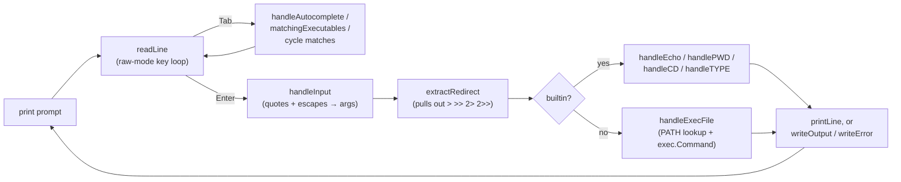

# shell-golang


A POSIX-flavoured Unix shell, written from scratch in Go — no `readline` library,
no shell-out to `/bin/sh`. It owns the terminal directly: raw-mode keystroke
handling, its own quote/escape parser, its own tab-completion engine, and its
own I/O redirection, all built on the standard library plus one terminal
package.

```
$ echo 'hello    world'
hello    world
$ echo "say \"hi\""
say "hi"
$ pwd > /tmp/where.txt
$ type cd
cd is a shell builtin
$ git st<TAB>
status
```

---

## Table of contents

- [Why this exists](#why-this-exists)
- [Features](#features)
  - [Builtins](#builtins)
  - [Quoting and escaping](#quoting-and-escaping)
  - [I/O redirection](#io-redirection)
  - [Tab completion](#tab-completion)
  - [External commands](#external-commands)
  - [Cross-platform correctness](#cross-platform-correctness)
- [Example session](#example-session)
- [How it works](#how-it-works)
- [Project structure](#project-structure)
- [Getting started](#getting-started)
- [Testing](#testing)
- [Known limitations](#known-limitations)
- [AI-assisted test generation](#ai-assisted-test-generation)
- [License](#license)

---

## Why this exists

Most "toy shell" projects stop at `fork` + `exec`. This one goes further into
the parts that make a shell feel like a shell rather than a REPL wrapped
around `os/exec`:

- a **hand-rolled parser** for single quotes, double quotes, and backslash
  escaping — with each combination's edge cases covered by tests, not assumed
- a **raw-mode key loop** that intercepts every keystroke, so Tab, Backspace,
  and Enter behave the way they do in a real terminal
- **PowerShell-style tab cycling** on ambiguous completions, on top of the
  usual bash-style longest-common-prefix and double-Tab listing
- **I/O redirection** (`>`, `>>`, `2>`, `2>>`) that works identically for
  builtins and external programs
- correctness that holds on **Windows, Linux, and macOS** alike — not just
  "compiles on Windows," but CRLF line endings on a real console, and a
  worked-around Windows append-mode quirk that would otherwise corrupt
  redirected output (see [Cross-platform correctness](#cross-platform-correctness))

## Features

### Builtins

| Command | Behaviour |
|---|---|
| `echo [args...]` | Prints its arguments joined by a single space. |
| `pwd` | Prints the current working directory. |
| `cd [path\|~]` | Changes directory. `~` resolves to `$HOME`. Errors clearly if the target doesn't exist. |
| `type <name>` | Reports whether `name` is a shell builtin, an external command (with its resolved path), or not found. |
| `exit` | Ends the read loop and terminates the shell. |

Anything that isn't one of the above is looked up on `PATH` and run as an
external program, with stdin/stdout/stderr connected straight through to the
shell's own (unless redirected — see below).

### Quoting and escaping

| Syntax | Behaviour |
|---|---|
| `'...'` | Everything inside is literal. No escape sequences are processed, not even `\`. |
| `"..."` | Literal, except `\"` → `"` and `\\` → `\`. Any other `\x` keeps **both** characters. |
| `\x` (outside quotes) | Escapes the next character, including a space. |
| `'...'​'...'` | Adjacent quoted strings concatenate into a single argument. |

```sh
$ echo 'hello    world'      # spaces preserved inside single quotes
hello    world
$ echo "say \"hi\""          # \" becomes a literal quote
say "hi"
$ echo hello\ world          # backslash escapes the space
hello world
$ echo 'foo''bar'            # adjacent quotes concatenate
foobar
```

### I/O redirection

| Operator | Effect |
|---|---|
| `>`, `1>` | Redirect stdout to a file, truncating it. |
| `>>`, `1>>` | Redirect stdout to a file, appending to it. |
| `2>` | Redirect stderr to a file, truncating it. |
| `2>>` | Redirect stderr to a file, appending to it. |

Redirection is parsed once per command and works the same way whether the
command is a builtin or an external program:

```sh
$ echo hello > out.txt
$ cat out.txt
hello
$ ls /no/such/dir 2>> errors.log
$ pwd 1>> session.log
```

### Tab completion

Pressing `Tab` on the current (bare) command word:

1. Checks a curated list of ~150 common Unix command names (`ls`, `grep`,
   `awk`, `cd`, …) for an unambiguous prefix match — this is a static
   completion table, independent of what's actually installed.
2. Falls back to scanning every directory on `PATH` for real executables
   matching the prefix.
3. Resolves the result:

   | Situation | Behaviour |
   |---|---|
   | No match | Terminal bell (`\x07`); input unchanged. |
   | Exactly one match | Completes it, with a trailing space. |
   | Multiple matches sharing a longer prefix than what's typed | Completes as far as that shared prefix (like bash). |
   | Multiple matches, first `Tab` | Bell only. |
   | Multiple matches, second `Tab` | Lists every match on its own line. |
   | Multiple matches, further `Tab`s | Cycles through the list one match at a time (PowerShell-style), until any other key breaks the cycle. |

Completion only triggers on a bare command prefix — once the line contains a
space, quote, or backslash, `Tab` is inserted as a literal character instead.

### External commands

Anything not recognised as a builtin is resolved with `exec.LookPath` against
`PATH` and run via `os/exec`, with `Stdin`/`Stdout`/`Stderr` wired to the
shell's own (or to a redirect target, if one was parsed). A command not found
on `PATH` produces a clear `<name>: command not found` instead of a raw Go
error.

### Cross-platform correctness

Two details that only surface on Windows, both handled explicitly rather than
patched around later:

- **Line endings.** `fmt.Println`'s bare `\n` is not translated to `\r\n` on
  Windows, so every line printed to a real console goes through `printLine`,
  which writes `\r\n` on an actual terminal and plain `\n` when stdout is a
  pipe (as in the e2e tests, which expect Unix-style output regardless of
  host OS).
- **Append-mode redirection.** Opening a file with `O_APPEND` and handing the
  handle to a child process only grants `FILE_APPEND_DATA` on Windows, which
  most child-process C runtimes can't actually write through. `handleExecFile`
  works around this by opening the file normally and seeking to end-of-file
  instead, so `>>` and `2>>` behave identically across platforms.

## Example session

```
$ pwd
/home/saikiran/project
$ cd ~
$ pwd
/home/saikiran
$ echo "the answer is \"42\""
the answer is "42"
$ type pwd
pwd is a shell builtin
$ type go
go is /usr/local/go/bin/go
$ nonexistent-cmd
nonexistent-cmd: command not found
$ echo done > result.txt
$ cat result.txt
done
$ exit
```

## How it works



Each stage is one function in [`main.go`](app/main.go), and each has its own
test block:

| Function | Responsibility |
|---|---|
| `readLine` | Byte-by-byte terminal input: raw mode, Backspace, Enter, and the full Tab-completion state machine. |
| `handleInput` | Tokenizes a raw line into `[]string`, resolving single quotes, double quotes, and backslash escapes. |
| `extractRedirect` | Pulls a trailing `>` / `>>` / `2>` / `2>>` and its target out of the argument list. |
| `handleEcho` | Joins the words after `echo` back into one line. |
| `handlePWD` | Returns the current working directory. |
| `handleCD` | Changes directory, resolving `~` to `$HOME`. |
| `handleTYPE` | Classifies a name as builtin, external (with resolved path), or not found. |
| `handleExecFile` | Resolves an external program on `PATH` and runs it, wiring up redirection if requested. |
| `handleAutocomplete` / `matchingExecutables` / `handleAutoCompleteExe` | The three completion sources `readLine` draws on. |
| `main` | The loop that ties all of the above together. |

## Project structure

```
app/
  main.go          the shell implementation (parser, builtins, completion, redirection, main loop)
  main_test.go     unit tests — one table-driven block per function
  e2e_test.go      end-to-end tests — build the binary, pipe in a session, check stdout
  report_test.go   the shared test reporter + assertion helpers (wantEqual, mustNoErr, ...)
  fuzz_test.go     fuzz targets for the parser and two builtins
  go.mod / go.sum
docs/              write-ups of specific bugfixes (e.g. the backslash-parsing fix)
CLAUDE.md          spec-driven test-generation instructions for Claude Code
test.sh            test runner — bash / Git Bash / Linux / macOS
test.ps1           test runner — PowerShell
```

## Getting started

**Requirements:** Go 1.26 or later.

```sh
git clone <this-repo>
cd shell-golang/app
go build ./...
go run .
```

```powershell
git clone <this-repo>
cd shell-golang\app
go build ./...
go run .
```

## Testing

The test suite is a pyramid of three layers, each catching a different class
of mistake:

| Layer | File | What it does |
|---|---|---|
| **Unit** | `app/main_test.go` | 40 table-driven test functions, one per function under test — a `handleCD` bug surfaces as a `handleCD` failure, not a mystery. Most of them target `handleInput`, since quote/escape parsing is the trickiest part of the shell. |
| **End-to-end** | `app/e2e_test.go` | 35 test functions that build the real binary and "type" a full session into it, then check what printed back — covering everything from plain `echo` to redirection to multi-Tab completion cycling. |
| **Fuzz** | `app/fuzz_test.go` | 3 targets (`FuzzHandleInput`, `FuzzHandleEcho`, `FuzzHandleTYPE`) that throw random and mutated input at the parser and two builtins looking for a crash. |

Every check, in every layer, goes through one shared reporter
([`report_test.go`](app/report_test.go)), so a test run reads like a
transcript of a shell session instead of a wall of Go stack traces:

```
✓ echo saikiran
    expected: saikiran
    received: saikiran

✗ echo it's
    expected: its
    received: it's
    why:      spec: single quotes are stripped from every argument
```

Passing checks (`✓`) only print under `-v`, which is why both runner scripts
always pass it.

### Running the tests

```sh
./test.sh [mode]        # bash / Git Bash / Linux / macOS
```
```powershell
.\test.ps1 [mode]       # PowerShell
```

| Mode | Runs |
|---|---|
| `unit` | `TestHandle*` only |
| `e2e` | `TestE2E*` only |
| `all` *(default)* | `go vet` + every test |
| `cover` | all tests + an HTML coverage report at `app/coverage.html` |
| `strict` | shuffled order, repeated 3×, `-timeout 5m` — catches ordering bugs and state leaks (some tests mutate the working directory and `HOME`) |
| `fuzz [duration]` | each fuzz target for `duration` (default `30s`) |

Environment variables the reporter respects:

| Variable | Effect |
|---|---|
| `NO_COLOR=1` | Disables ANSI colour in test output. |
| `SHELL_TEST_ASCII=1` | Swaps `✓` / `✗` for `[PASS]` / `[FAIL]` on consoles that can't render UTF-8. |

## Known limitations

- **One redirect per command.** `extractRedirect` stops at the first
  redirection operator it finds — `cmd > out.txt 2> err.txt` on the same line
  only honours whichever one it hits first.
- **No pipes, no chaining.** `|`, `&&`, `||`, `;`, and background `&` are not
  parsed — each line is a single command.
- **No variable or glob expansion.** `$VAR` and `*.txt` are passed through
  literally, not expanded.
- **No stdin redirection.** `<file` is not supported, only the output
  operators listed above.
- **`~` depends on `$HOME`.** On Windows, `HOME` isn't set by default outside
  Git Bash / WSL, so `cd ~` needs it exported explicitly.
- **Builtins shadow `PATH`.** A real `echo` or `pwd` binary on `PATH` is never
  reached — the builtin always wins.

## AI-assisted test generation

This repo pairs its own implementation with a spec-driven testing workflow:
[`CLAUDE.md`](CLAUDE.md) is a full instruction set for Claude Code describing
exactly how new tests should be derived from a feature's *spec* (not its
implementation), which table (`_Valid` / `_Edge` / `_MustFail`) each case
belongs in, and how to phrase the `why` field that the reporter prints on
failure. It's the reason every test block in this project follows the same
shape regardless of which session wrote it.

## License

No license file is currently included in this repository — all rights
reserved by default until one is added.
