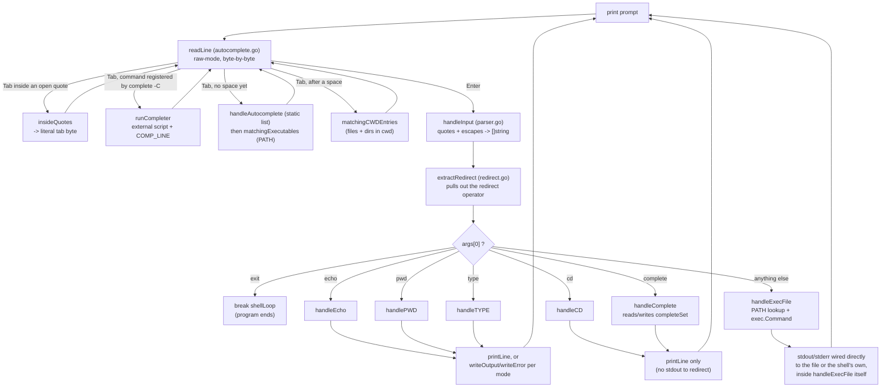

# Internals

A line-by-line walkthrough of every file in `app/`: what each function is
handed, what decision it makes, and exactly what comes back out. Nothing here
is guessed from file names — it is read directly off the current source.

If you just want to *use* the shell, the [README](../README.md) is enough. This
document is for changing it.

- [`main.go` — the loop and the dispatcher](#maingo--the-loop-and-the-dispatcher)
- [`parser.go` — turning one typed line into arguments](#parsergo--turning-one-typed-line-into-arguments)
- [`builtins.go` — the commands the shell handles itself](#builtinsgo--the-commands-the-shell-handles-itself)
- [`redirect.go` — sending output to a file](#redirectgo--sending-output-to-a-file)
- [`autocomplete.go` — the Tab key](#autocompletego--the-tab-key)
- [Flowchart: one command, start to finish](#flowchart-one-command-start-to-finish)
- [Cross-platform correctness](#cross-platform-correctness)
- [Known quirks in the current code](#known-quirks-in-the-current-code)

---

## `main.go` — the loop and the dispatcher

`main.go` has exactly one function, `main()`, and it is the whole program's
skeleton. Everything else exists to be called from here.

It starts by building `builtInSet`, a `map[string]string` whose **keys** are the
recognised builtin names — the values are unused placeholders. Only *membership*
in the map matters; it exists purely so `handleTYPE` can answer "is this name a
builtin?" with a map lookup instead of a chain of `if` statements. (See
[Known quirks](#known-quirks-in-the-current-code) — one of the keys currently has
a typo.)

Then it enters a `for` loop labelled `shellLoop`. The label exists so the `exit`
command can `break shellLoop`; a bare `break` inside the `switch` below would
only exit the `switch`, not the outer loop. Each pass:

1. Prints `$ ` as the prompt (no newline).
2. Calls `handleInput` to read and tokenize one line into `args []string`.
   - On error — which happens when reading stdin itself fails, e.g. stdin closed
     / EOF — the shell prints the error and **returns**, ending the program. No
     crash, no `exit` message; the process just stops.
   - If the line was empty or all whitespace, `args` comes back empty and the
     loop prints a fresh prompt (`continue`).
3. Calls `extractRedirect(args)` to strip out a `>` / `>>` / `2>` / `2>>` and its
   target file, if present. A malformed redirect (the operator with nothing after
   it) prints a syntax error and skips to the next prompt — the command never
   runs.
4. Switches on `args[0]` to decide what to do:

| `args[0]` | What runs | What happens to its output |
|---|---|---|
| `exit` | nothing else — `break shellLoop` | the loop (and the program) ends |
| `echo` | `handleEcho` (can't fail) | stdout redirect (`mode` 1 or 3) → `writeOutput`; otherwise `printLine` |
| `pwd` | `handlePWD` | on error: stderr redirect (`mode` 2 or 4) → `writeError`, else `printLine` a wrapped message. On success: stdout redirect → `writeOutput`, else `printLine` |
| `cd` | `handleCD` | **never redirected** — `cd` has no output, so any `>`/`2>` on a `cd` line is parsed and then ignored; only a failure message goes to `printLine` |
| `type` | `handleTYPE` | same pattern as `pwd`: error → stderr redirect or `printLine`; success → stdout redirect or `printLine` |
| `complete` | `handleComplete` | **never redirected**, same as `cd`. Returns a single string, which `main.go` prints via `printLine` only when it is non-empty — so successful `-C` and `-r` registrations stay silent |
| anything else | `handleExecFile` | wires up redirection itself (see below); `main.go` only prints if it came back with an error |

One detail that is easy to misread: in the `default` branch, `handleExecFile`
returns a `(msg string, err error)` pair, but `main.go` only ever prints
`err.Error()` — the `msg` string it also returns (things like
`"<name>: command not found"`) is **never shown to the user**.

## `parser.go` — turning one typed line into arguments

One function: `handleInput(reader *bufio.Reader) ([]string, error)`.

It first calls `readLine` (defined in `autocomplete.go`) to get one raw line of
text — the only place the two files connect — trims surrounding whitespace, then
walks the line **one rune at a time**, building a slice of arguments with a small
state machine. Five flags track where the scanner is:

| Flag | Meaning while true |
|---|---|
| `inArg` | the current argument has been started (even if still empty — this is what makes `''` a real, empty argument rather than nothing at all) |
| `inQuote` | inside a single-quoted run: every character is copied literally, including backslashes, until the closing quote |
| `inDoubleQuote` | inside a double-quoted run: literal, except that a backslash defers its decision to `pendingEscape` |
| `slash` | the previous character (outside any quotes) was a backslash: whatever comes next is kept as-is, even a space |
| `pendingEscape` | the previous character (inside double quotes) was a backslash: resolved against the next rune — an escaped quote or escaped backslash collapses to one literal character, anything else keeps **both** the backslash and the character |

The rune-by-rune decision order is: finish a pending outside-quote escape →
handle single-quote body → handle double-quote body → open a single quote → open
a double quote → start an outside-quote escape → end the current argument on
unquoted space/tab → otherwise append the character. After the line has been
scanned, an argument still open (no trailing whitespace closed it) is flushed as
the last element.

**Output:** `([]string, error)`. The only error path is `readLine` itself failing
(e.g. stdin closed) — the parsing logic can never fail on its own, however
malformed the quoting is. An unterminated quote simply consumes to end of line.

A worked example of how one escape rule was got wrong and then fixed is in
[backslash-parsing-fix.md](backslash-parsing-fix.md).

## `builtins.go` — the commands the shell handles itself

| Function | Given | Decides | Returns / prints |
|---|---|---|---|
| `handleEcho(args)` | the full `["echo", ...]` slice | nothing to decide — joins `args[1:]` with single spaces | `(string, error)` — the joined line; error is always `nil` |
| `handlePWD(args)` | `args` (ignored entirely — kept only so the function shape matches the other handlers) | calls `os.Getwd()` | `(string, error)` — the working directory, or the OS error |
| `handleCD(args)` | `args` | `len(args) < 2` → `"cd: missing operand"`. A bare `~` resolves `$HOME` and `os.Chdir`s there (only a bare tilde; `~/path` and `~user` are **not** expanded — they are treated as literal directory names and will fail). Otherwise `os.Chdir(args[1])` directly. A missing target gets a friendly `"No such directory"` / `"No such home directory"`; any other OS error passes through unchanged | `error` only — `cd` never prints on success |
| `handleTYPE(args, builtInSet)` | the name being asked about, plus the builtin-name set from `main.go` | no name given → `"No args provided"`, **nil error**. Name is a key in `builtInSet` → `"<name> is a shell builtin"`. Otherwise `exec.LookPath`s it: not found → `"<name>: not found"`, still **nil error**; a real lookup failure → `"Error while visiting file"` with that error; found → `"<name> is <resolved path>"` | `(string, error)` — both the "no args" and "not found" cases are *not* errors, so `main.go` treats them as success and would happily redirect either to a file |
| `handleComplete(args)` | the full `["complete", ...]` slice | dispatches on `args[1]`; see the table below | `string` **only** — no error return at all. An empty string means "say nothing" |
| `handleExecFile(args, redirectTarget, mode)` | the command + arguments, plus the redirect target/mode already parsed | `exec.LookPath(args[0])`: not found or unreadable → a friendly message **alongside a non-nil error** (see callout). Otherwise builds an `exec.Command` wired to the shell's own stdin/stdout/stderr, then — if `mode` is 1–4 — opens `redirectTarget` and points `Stdout` (modes 1/3) or `Stderr` (modes 2/4) at it instead. Runs it | `(string, error)` — like `type`'s not-found case but inverted: here the friendly string is **paired with a non-nil error**, and `main.go` prints `err.Error()`, not the friendly string |

### `handleComplete` in detail

State lives in one package-level map, `completeSet map[string]string`, keyed by
command name with the completer script's path as the value. It is in-memory only
— nothing is persisted between runs.

| Form | Effect | Returns |
|---|---|---|
| `complete -C <script> <cmd>` | `completeSet[args[3]] = args[2]` — note the argument order: the **script comes first**, the command name second | empty (silent) |
| `complete -p <cmd>` | looks `<cmd>` up | `complete -C '<script>' <cmd>`, or `complete: <cmd>: no completion specification` if unregistered |
| `complete -r <cmd>` | `delete(completeSet, args[2])` — deleting a key that was never there is a no-op, not an error | empty (silent) |
| fewer than 2 args, or too few args for the given flag | — | `In-Valid number of arguments` |
| any other first argument | — | `complete: <arg>: no completion specification` |

Because the return type is a bare `string`, every one of these is a "success"
from `main.go`'s point of view — the error messages are printed, but there is no
error value, so none of them can be captured with `2>`.

**Why the friendly "command not found" message never appears:** `main.go`'s
`default` case only checks
`if msg != "" || err != nil { printLine(err.Error()) }`. Every path in
`handleExecFile` that sets a non-empty `msg` also sets a non-nil `err`, so this
never panics — but it also means the carefully built string
`"<name>: command not found"` is dead code from the user's point of view. What
actually prints is the raw Go/`exec` error:

```
$ nonexistent-cmd
exec: "nonexistent-cmd": executable file not found in $PATH
```

## `redirect.go` — sending output to a file

| Function | Given | Decides | Returns / prints |
|---|---|---|---|
| `extractRedirect(args)` | the full argument list | scans left to right for the **first** `>`, `1>`, `2>`, `>>`, `1>>`, or `2>>` token. Found with nothing after it → syntax error. Otherwise removes the operator and its target from the list | `([]string, string, error, int)` — cleaned args, target filename, error (nil unless malformed), and a `mode`: `1`=stdout truncate, `2`=stderr truncate, `3`=stdout append, `4`=stderr append, `0`=none |
| `printLine(s)` | one line of text | checks the package-level `stdoutIsTerm`, computed once via `term.IsTerminal` on stdout's descriptor | on a real console: a trailing `\r\n` (a plain `\n` does not return the cursor to column 0 on Windows, so every subsequent line would stair-step rightward); on a pipe, as in every e2e test: a plain `\n` via `fmt.Println` |
| `writeOutput(target, s, mode)` | a target path, the text, the mode | empty target → falls back to `printLine` (defensive; `main.go` only calls this when a target exists). `mode == 1` → `os.WriteFile` (create + truncate). Otherwise append → opens with `O_APPEND` and writes the line | `error` |
| `writeError(target, err, mode)` | a target path, an error, the mode | `err == nil` → does nothing. Otherwise the same truncate-vs-append split, writing `err.Error()` instead of a plain string | `error` |

## `autocomplete.go` — the Tab key

This file owns reading a line character-by-character and reacting to Tab,
Backspace, and Enter as they are pressed — not after a whole line is typed.

- **`autocompleteCommands`** — a hard-coded list of ~150 common Unix command
  names (`ls`, `grep`, `awk`, `cd`, …). A *static* list, independent of what is
  actually installed on the machine.
- **`handleAutocomplete(partial)`** — a linear scan of that list for the first
  name starting with `partial`. Returns the name plus a trailing space on a hit,
  or an empty string for no match / empty input.
- **`matchingExecutables(partial)`** — walks every directory on `$PATH` (split
  with `filepath.SplitList`, so the separator is right on every OS), reads each
  one (silently skipping any that do not exist — `PATH` is allowed to list stale
  entries), and collects every **file** (not subdirectory) whose name starts with
  `partial` into a de-duplicated, alphabetically sorted `[]string`.
- **`matchingCWDEntries(partial)`** — entries in the current working directory,
  files **and** directories, whose name starts with `partial`. `os.ReadDir`
  already returns them sorted by name.
- **`runCompleter(script, args, compLine, compPoint)`** — runs a registered
  completer as an external process and reads candidates back from its stdout. It
  follows bash's programmable-completion convention:

  | Channel | What the script receives |
  |---|---|
  | `os.Args[1]` | the command name being completed (e.g. `git`) |
  | `os.Args[2]` | the word currently being completed — possibly empty |
  | `os.Args[3]` | the word before it, or empty on the first argument |
  | `COMP_LINE` | the whole raw input line so far |
  | `COMP_POINT` | the cursor offset, which is always `len(input)` — this shell has no cursor movement, so Tab is always at the end of the line |

  The script's stdout is split on newlines, each line has a trailing `\r`
  trimmed, and blank lines are dropped. A non-zero exit status is treated as "no
  candidates". The shell blocks until the script exits, so a slow completer
  stalls the prompt.
- **`insideQuotes(input)`** — re-runs the parser's quote state machine over the
  raw bytes typed so far and reports whether a quote is still open. `readLine`
  consults it *before* treating a Tab as a completion trigger, so a Tab typed
  inside an open quote is appended as a literal tab character instead. This is
  what makes a tab inside a quoted argument survive into the parsed argument.
- **`longestCommonPrefix(strs)`** — shrinks `strs[0]` until every other string
  starts with it. Assumes `strs` is non-empty; every caller only invokes it once
  it already knows there are 2 or more matches.
- **`readLine(reader)`** — the interactive loop, and the most involved function
  in the project. If stdin is a real terminal it switches to raw mode
  (`term.MakeRaw`) so every keystroke arrives the instant it is pressed instead
  of only after the OS hands over a whole buffered line, and restores the
  original settings when it returns. It then reads one byte at a time:

  | Key | What happens |
  |---|---|
  | Enter (`\r` or `\n`) | on a real terminal, prints `\r\n` to move down visually; returns the accumulated line |
  | Backspace (byte `127` or `8`) | resets any in-progress Tab-cycle state; drops the last byte typed, if any |
  | Tab (`\t`) | inserted literally if `insideQuotes`; otherwise runs the state machine below |
  | anything else | resets Tab-cycle state; appends the byte |

  After every byte, on a real terminal the line is redrawn in place: `\r` returns
  the cursor to column 0, `\033[K` (ANSI "erase to end of line") clears whatever
  was there, and the prompt plus the current buffer is reprinted.

### The Tab state machine

If a list of ambiguous matches is already being cycled through, every further Tab
just advances to the next one — no re-matching happens. Otherwise the buffer is
split at the *last space* into `prefix` (everything before and including that
space, carried through untouched) and `word` (what is actually being completed).
Which completion source runs is then decided in this order:

1. **A registered completer, if one exists.** `strings.Fields(prefix)` gives the
   words already typed; if the **first** of them is a key in `completeSet`, that
   script is run via `runCompleter` and its candidates are used. This source wins
   over everything below. It applies only to arguments — on the command word
   itself `prefix` is empty, so there are no fields to look up.
2. **No space yet (`prefix` empty, completing the command word):** try
   `handleAutocomplete(word)` against the static list first, then fall back to
   `matchingExecutables(word)` against real `PATH` executables.
3. **A space exists (completing a later argument):** match against
   `matchingCWDEntries(word)`. A single directory match gets a trailing `/`
   instead of a trailing space, inviting further typing into it; a single file
   match gets a trailing space, being a finished argument.

All three then resolve the same way based on how many matches came back:

| Matches | Result |
|---|---|
| 0 | terminal bell (`\x07`); input unchanged |
| 1 | completed immediately, with a trailing space (or `/` for a directory) |
| 2+, sharing a longer common prefix than what is typed | filled up to that shared prefix (bash-style), no bell |
| 2+, no longer shared prefix, first Tab | bell only |
| 2+, no longer shared prefix, second Tab | every match printed on its own line, and the list stored so the **next** Tab starts cycling through them one at a time (PowerShell-style) — any other key breaks the cycle |

Two caveats on that table. The registered-completer branch does **not** store a
cycle list, so PowerShell-style cycling is available only for the static/PATH and
cwd sources; and it also diverges on the "first Tab" row — see
[Known quirks](#known-quirks-in-the-current-code) below.

**What completion still does not understand.** The split is done on raw bytes at
the last space, so quoting is invisible to it. `insideQuotes` handles the single
case of a Tab pressed *inside* an open quote, but a quoted word is otherwise
matched literally: a partially typed `"my fi` is matched as the text `"my`
(opening quote included), which normally matches nothing on a real filesystem and
so just rings the bell. Nor is a backslash-escaped space recognised as joining
one word.

## Flowchart: one command, start to finish



## Cross-platform correctness

Two details that only surface on Windows, both handled explicitly rather than
patched around later:

- **Line endings.** `fmt.Println`'s bare newline is not translated to `\r\n` on
  Windows, so every line printed to a real console goes through `printLine`,
  which writes `\r\n` on an actual terminal and a plain newline when stdout is a
  pipe (as in the e2e tests, which expect Unix-style output regardless of host
  OS).
- **Append-mode redirection.** Opening a file with `O_APPEND` and handing the
  handle to a *child process* only grants `FILE_APPEND_DATA` on Windows, which
  most child-process C runtimes cannot write through. So for append modes (3 and
  4), `handleExecFile` opens the file normally and seeks to end-of-file itself
  instead of relying on `O_APPEND`. `writeOutput` and `writeError` do not need
  the trick, because they write from inside the shell's own process, where
  `O_APPEND` behaves normally.

## Known quirks in the current code

Documented rather than fixed, so nobody has to rediscover them from scratch.

**1. `type complete` reports "not found."** `builtInSet` in
[main.go:18](../app/main.go#L18) registers the key as `"complete "` — with a
trailing space. `handleTYPE` looks up `"complete"`, misses, and falls through to
`exec.LookPath`, so the shell denies that its own builtin is a builtin. The other
five names are unaffected. The fix is deleting one space.

**2. An ambiguous completer result lists on the first Tab, not the second.** In
the registered-completer branch,
[autocomplete.go:252-270](../app/autocomplete.go#L252-L270):

```go
default: // 2+ candidates
    if consecutiveTabs < 2 {
        lcp := longestCommonPrefix(candidate)
        if len(lcp) > len(word) {
            input = []byte(prefix + lcp)
            consecutiveTabs = 0
            break          // breaks the switch, skipping the listing
        } else {
            fmt.Print("\x07")
        }
    }
    // reached when consecutiveTabs >= 2 *or* when the else above just ran
    ... print the candidate list ...
```

When the candidates share no prefix longer than what is typed, the `else` arm
rings the bell and then falls straight through into the listing block on the same
keystroke — so the user gets a bell *and* the full list on the first press. The
static/PATH and cwd branches both `break` after their bell and correctly wait for
a second Tab.

The e2e tests do not catch this: `assertContainsWhy` only asserts that the
expected substring is present, and a bell followed by an early listing still
contains the bell.
